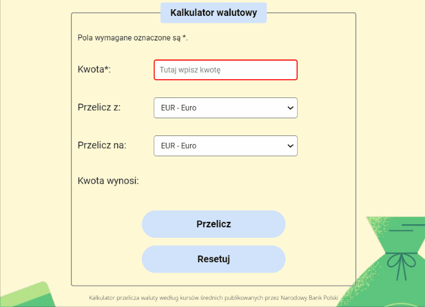

# Currency-converter
A currency converter is a tool that allows you to convert the value of one currency into another. Additionaly, depending on the currency you choose, it shows currency exchange rate. The currencies used in the converter are the following: 
- EUR
- CHF
- USD
- GBP
- AUD
- PLN

To use a currency converter, you typically enter the amount of money you want to convert, select the currency you are converting from, and then choose the currency you want to convert to. The converter will then display the converted amount based on the current exchange rate between the two currencies. Below short demonstration:

## Demo
https://aleksandra-nie.github.io/currency-converter-react/
## Tools
- HTML
- CSS
- JavaScript
- BEM convention
- Normalize
## Features
- Currency converter is responsive on both website and mobile phone
- Bem convention was added due to easier code review
## Additional information
Currency exchange rates were based according to the average exchange rate of the National Bank of Poland on 23.03.2023:
- 1 USD = 4.3981 PLN
- 1 EUR = 4.6871 PLN
- 1 GBP = 5.2836 PLN
- 1 CHF = 4.7156 PLN
- 1 AUD = 2.9292 PLN
## Future improvements
- include more currencies
- data based on the latest currency exchange rates
## Available Scripts

In the project directory, you can run:

### `npm start`

Runs the app in the development mode.\
Open [http://localhost:3000](http://localhost:3000) to view it in your browser.

The page will reload when you make changes.\
You may also see any lint errors in the console.

### `npm run build`

Builds the app for production to the `build` folder.\
It correctly bundles React in production mode and optimizes the build for the best performance.

The build is minified and the filenames include the hashes.\
Your app is ready to be deployed!

See the section about [deployment](https://facebook.github.io/create-react-app/docs/deployment) for more information.

### `npm run eject`

**Note: this is a one-way operation. Once you `eject`, you can't go back!**

If you aren't satisfied with the build tool and configuration choices, you can `eject` at any time. This command will remove the single build dependency from your project.

Instead, it will copy all the configuration files and the transitive dependencies (webpack, Babel, ESLint, etc) right into your project so you have full control over them. All of the commands except `eject` will still work, but they will point to the copied scripts so you can tweak them. At this point you're on your own.

You don't have to ever use `eject`. The curated feature set is suitable for small and middle deployments, and you shouldn't feel obligated to use this feature. However we understand that this tool wouldn't be useful if you couldn't customize it when you are ready for it.
